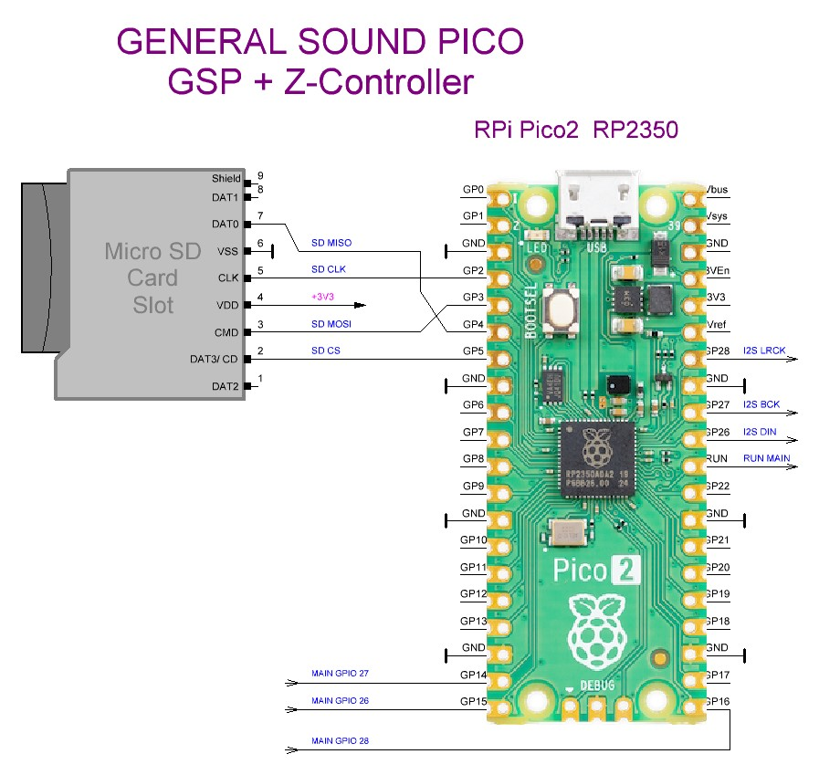
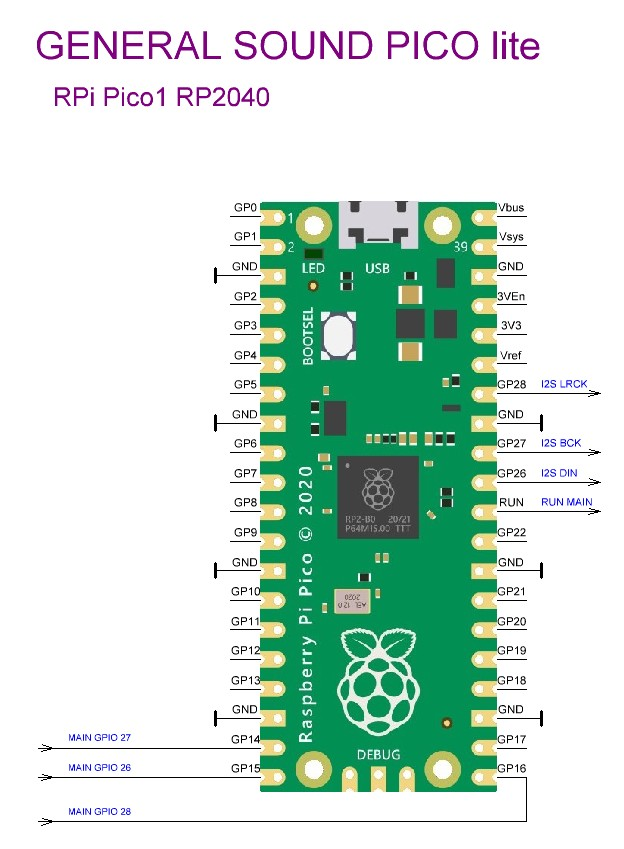

# GSP  — General Sound Pico эмулятор

> **🌐 Язык / Language:** [🇷🇺 Русский](#russian-version) | [🇬🇧 English](#english-version)

---

## 🇷🇺 Русский

Эмулятор **General Sound Pico (GSP)** для SpeccyP https://github.com/billgilbert7000/SpeccyP (Murmulator).

Проект на двух RP2350 или RP2040+RP2350 https://github.com/billgilbert7000/PCB_SpeccyP_GSP (Версии плат M2)

Проект позволяет эмулировать несколько звуковых и периферийных устройств на двух платах Raspberry Pi Pico (RP2040/RP2350), соединённых через высокоскоростной интерфейс **PicoBus**.

### 🎵 Эмулируемые устройства

- **General Sound** — полная эмуляция звуковой карты
- **TurboSound** — эмуляция на основной плате
- **Z-Controller** — контроллер SD-карты (используется разъём SD на дополнительной плате)
- **MIDI** — упрощённая тестовая версия (порты 0xA1CF, 0xA0CF)

### 🔧 Требования к аппаратному обеспечению

- **Две платы Murmulator первой ревизии (MURM1)**
- **Основная плата**:
  - Прошивка: `SpeccyP_1.5.7_GS_m1p1.uf2` (RP2040) или `SpeccyP_1.5.7_GS_m1p2.uf2` (RP2350)
- **Дополнительная плата (MURM1 с I2S звуком)**:
  - Только для **RP2350**
  - Прошивка: `GSP-PSRAM_1.5.7_m1p2.uf2` (с PSRAM, CS=19, доступно 2048 КБ)

### 🔌 Подключение плат

Соедините платы проводами **минимальной длины**:

| Основная плата (MAIN) | Дополнительная плата (GS) |
|----------------------|---------------------------|
| GPIO 26              | GPIO 15                   |
| GPIO 27              | GPIO 14                   |
| GPIO 28              | GPIO 16                   |
| RUN                  | RUN                       |
| GND                  | GND                       |

#### ⚠️ Важные настройки перемычек

1. **Основная плата**: перемычки на звук (26, 27, 28, 29) должны быть убраны
2. **Дополнительная плата**: перемычки (14, 15, 16, 17) на джойстик должны быть убраны

#### 💡 Питание

Подайте питание **+5V** на обе платы (желательно от одного источника). Для тестирования можно использовать питание от USB компьютера.

### 🚀 Запуск и синхронизация

При включении платы должны синхронизироваться. Если на экране появляется синяя надпись **«PicoBus connected...»** — синхронизация не удалась. Помогает нажатие кнопки **RUN** на любой из плат.

### 🎮 Управление

- **Громкость**: `[F7]` и `[F8]`
- **Buster I2S**: регулировка в разумных пределах

### 💾 Поддерживаются программы и игры для General Sound

### 🔌 PicoBus интерфейс
- Скорость: **20 Мбит/с**
- Тип: асинхронный, полнодуплексный, без тактового сигнала
- Топология: одноранговая

### 👥 Благодарности
- **[Евгений @SeritCacba](https://github.com/SeritCacba)** — за идею реализации General Sound на Raspberry Pi Pico
- **[Manuel Sainz](https://github.com/redcode)** — за высококачественный эмулятор Z80, используемый в проекте
- **[Derek Fountain](https://github.com/derekfountain)** — за идею и реализацию высокоскоростного обмена данными между двумя Pico (PicoBus)
- **Автор прошивки** — за проделанную титаническую работу и… «добавленные баги» 😉

---
### 🔗 Ссылки
- [ZX_MURMULATOR](https://t.me/ZX_MURMULATOR) — телеграм канал
- [Сайт проекта murmulator.ru](https://murmulator.ru) — подробности по используемым платам и дополнительная информация
- [Репозиторий эмулятора Z80](https://github.com/redcode/Z80)
- [PiCard](https://t.me/zx_divmmc) — телеграм канал ветка PiCard

#### ⚠️ Проект находится в активной разработке. Возможны изменения в совместимости и функциональности.

  
   
  <em>GSP</em>

  
   
  <em>GSP lite</em>

---

[🔝 Наверх](#russian-version) | [🇬🇧 Read in English](#english-version)

---

## 🇬🇧 English

**General Sound Pico (GSP)** emulator for SpeccyP https://github.com/billgilbert7000/SpeccyP (Murmulator).

Project based on two RP2350 or RP2040+RP2350 https://github.com/billgilbert7000/PCB_SpeccyP_GSP (M2 board versions)

The project emulates multiple sound and peripheral devices using two Raspberry Pi Pico boards (RP2040/RP2350) connected via the high-speed **PicoBus** interface.

### 🎵 Emulated Devices

- **General Sound** — full sound card emulation
- **TurboSound** — emulation on the main board
- **Z-Controller** — SD card controller (uses SD slot on the additional board)
- **MIDI** — simplified test version (ports 0xA1CF, 0xA0CF)

### 🔧 Hardware Requirements

- **Two Murmulator first revision boards (MURM1)**
- **Main board**:
  - Firmware: `SpeccyP_1.5.7_GS_m1p1.uf2` (RP2040) or `SpeccyP_1.5.7_GS_m1p2.uf2` (RP2350)
- **Additional board (MURM1 with I2S audio)**:
  - **RP2350 only**
  - Firmware: `GSP-PSRAM_1.5.7_m1p2.uf2` (with PSRAM, CS=19, 2048 KB available)

### 🔌 Board Connection

Connect the boards with **minimum length** wires:

| Main Board (MAIN) | Additional Board (GS) |
|-------------------|------------------------|
| GPIO 26           | GPIO 15                |
| GPIO 27           | GPIO 14                |
| GPIO 28           | GPIO 16                |
| RUN               | RUN                    |
| GND               | GND                    |

#### ⚠️ Important Jumper Settings

1. **Main board**: audio jumpers (26, 27, 28, 29) must be removed
2. **Additional board**: joystick jumpers (14, 15, 16, 17) must be removed

#### 💡 Power Supply

Apply **+5V** power to both boards (preferably from the same source). For testing, USB power from a computer can be used.

### 🚀 Startup and Synchronization

When powered on, the boards should synchronize. If a blue message **"PicoBus connected..."** appears on screen — synchronization failed. Pressing the **RUN** button on either board helps.

### 🎮 Controls

- **Volume**: `[F7]` and `[F8]`
- **Buster I2S**: adjust within reasonable limits

### 💾 Supported Programs and Games for General Sound

### 🔌 PicoBus Interface
- Speed: **20 Mbit/s**
- Type: asynchronous, full-duplex, without clock signal
- Topology: peer-to-peer

### 👥 Acknowledgments
- **[Eugene @SeritCacba](https://github.com/SeritCacba)** — for the idea of implementing General Sound on Raspberry Pi Pico
- **[Manuel Sainz](https://github.com/redcode)** — for the high-quality Z80 emulator used in the project
- **[Derek Fountain](https://github.com/derekfountain)** — for the idea and implementation of high-speed data exchange between two Picos (PicoBus)
- **Firmware author** — for the titanic work and… "added bugs" 😉

---
### 🔗 Links
- [ZX_MURMULATOR](https://t.me/ZX_MURMULATOR) — Telegram channel
- [murmulator.ru project website](https://murmulator.ru) — details about the boards used and additional information
- [Z80 emulator repository](https://github.com/redcode/Z80)
- [PiCard](https://t.me/zx_divmmc) — Telegram channel PiCard branch

#### ⚠️ The project is under active development. Compatibility and functionality may change.

  
   
  <em>GSP</em>

  
   
  <em>GSP lite</em>

---

[🔝 Back to top](#english-version) | [🇷🇺 Читать по-русски](#russian-version)
